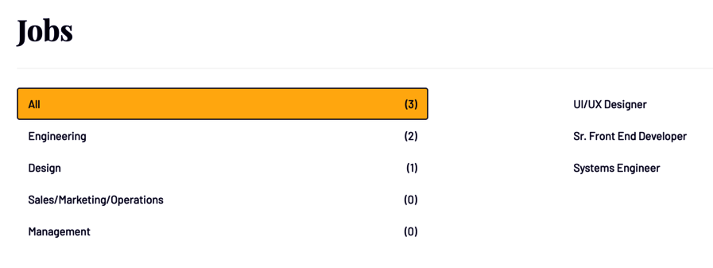

# End Of Field Challenge Exam, Becode

## "Using Css, HTML, Markdown, Responsive Design to make a code result as similar as a picture"

This project consists of the setting up responsive code lines, to make the result as close as a given picture as possible, without using framework and coding something personal and authentical.
***

## 1. My index page 

### How did I proceed?  :mag:

I have to admit that it was a lot of pleasure to find glowing effect on the internet and adapt as I want to create my two buttons and a title. Making the page responsive was the chalenge of my index page.
### final result  :firework:

[Click here t see the final result](https://adrienclesse.github.io/end-of-field-challenge/)
***

## 2. The interface simple n°12

### Sample preview

### How did I proceed?  :mag:
The size might look rather big because the exercice has been realised on the high definition sample.
To make my code as similar as the image as possible, I've found similar found and colours for my css, played a lot of margin and padding and have copy paste the original image.  My cup of tea is grid so I've used a grid display to separate the image from the text section.

### final result  :firework:

[Click here t see the final result](https://adrienclesse.github.io/end-of-field-challenge/simple-12.html)

***
## 3. The interface complex n°6

### Sample preview

### How did I proceed?  :mag:
To design it, I used a flexbox to separate the two main sections, a grid for the tbale as grid is my cup of tea and I admit having used a long way to make the first table line with a yellow back ground.

### final result  :firework:

[Click here t see the final result](https://adrienclesse.github.io/end-of-field-challenge/complex-6.html)

## Tools and Techs :scissors:
Building with
+ Visual Studio Code(HTML, CSS)
+ Markdown
+ Google fonts
+ https://imagecolorpicker.com/en/
***
## Autor and Rights :copyright:
Developed by [Adrien CLesse](https://github.com/adrienclesse) for [BeCode](https://becode.org/)
***

## Products :floppy_disk:

* Interface#1 [<< View the product >>][Address1]

[Address1]: https://trial-run-interface1.netlify.app/

* Interface#2 [<< View the product >>][Address2] (*for Movile Devices) --No Responsive

[Address2]: https://trial-run-interface2.netlify.app/

* Interface#3 [<< View the product >>][Address3] --No Responsive

[Address3]: https://tiral-run-interface3.netlify.app/

***
*Copyrights to Adrien Clesse for BeCode* :memo:
