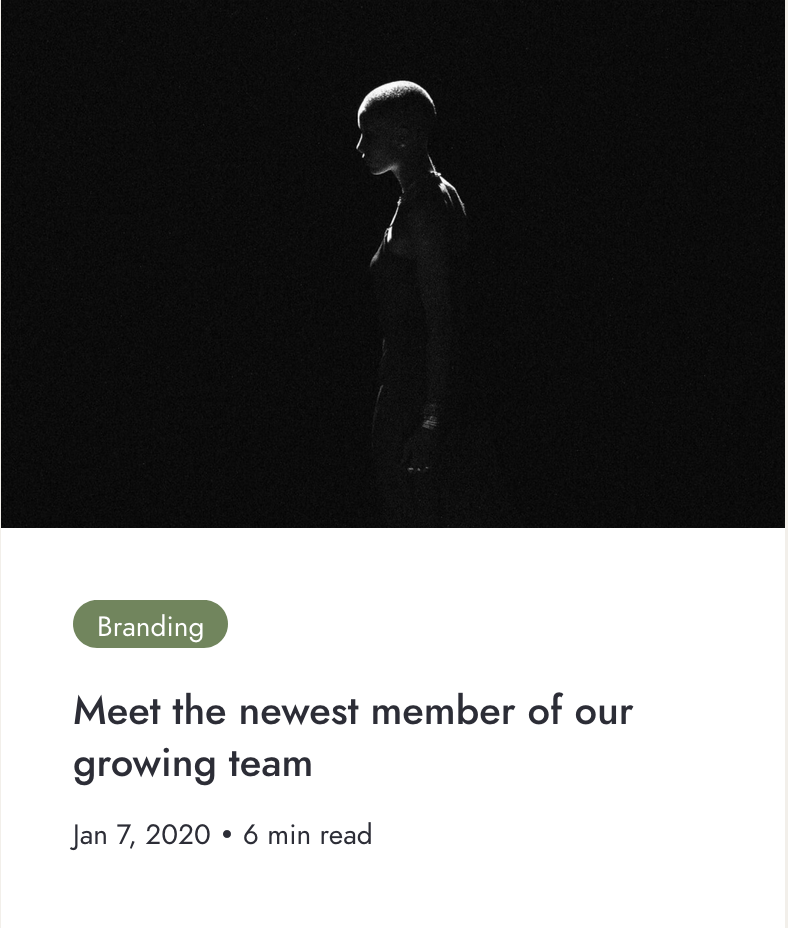

# End Of Field Challenge Exam, Becode

## "Using Css, HTML, Markdown, Responsive Design to make a code result as similar as a picture"
***
This project consists of the setting up responsive code lines, to make the result as close as a given picture as possible, without using framework and coding something personal and authentical:
***
## The interface 12

To make my code as similar as the image as possible, I've found similar found and colour, played a lot of margin and padding and have copy paste the original image.

## Restrictions :notebook:
In relation to the product Interface # 1, due to an involuntary error it was developed in time, using the required structure, but with erroneous content; It has bugs in the font, color and content of the text. it had to be corrected in a short time.
***
## Tools and Techs :hammer:
Building with
+ Visual Studio Code(HTML, CSS)
+ Macromedia Fireworks
+ Markdown
+ a Lot of Google
***
## Autor and Rights :bulb:
Developed by [Victor Ortega](https://github.com/ortegaVictorBe) for BeCode(https://becode.org/)
**

## Products :floppy_disk:

* Interface#1 [<< View the product >>][Address1]

[Address1]: https://trial-run-interface1.netlify.app/

* Interface#2 [<< View the product >>][Address2] (*for Movile Devices) --No Responsive

[Address2]: https://trial-run-interface2.netlify.app/

* Interface#3 [<< View the product >>][Address3] --No Responsive

[Address3]: https://tiral-run-interface3.netlify.app/

***
## Thanks :gift:
God,PowerBuilder, TurboPascal, Becode, Fedasil.

***
*Copyrights to Victor Ortega for BeCode* :memo:
